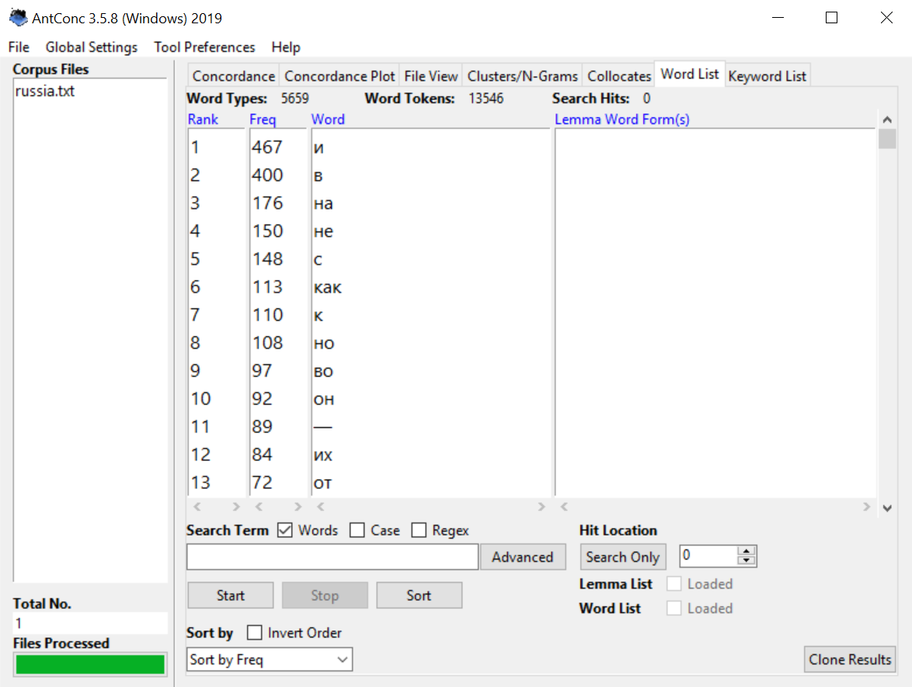
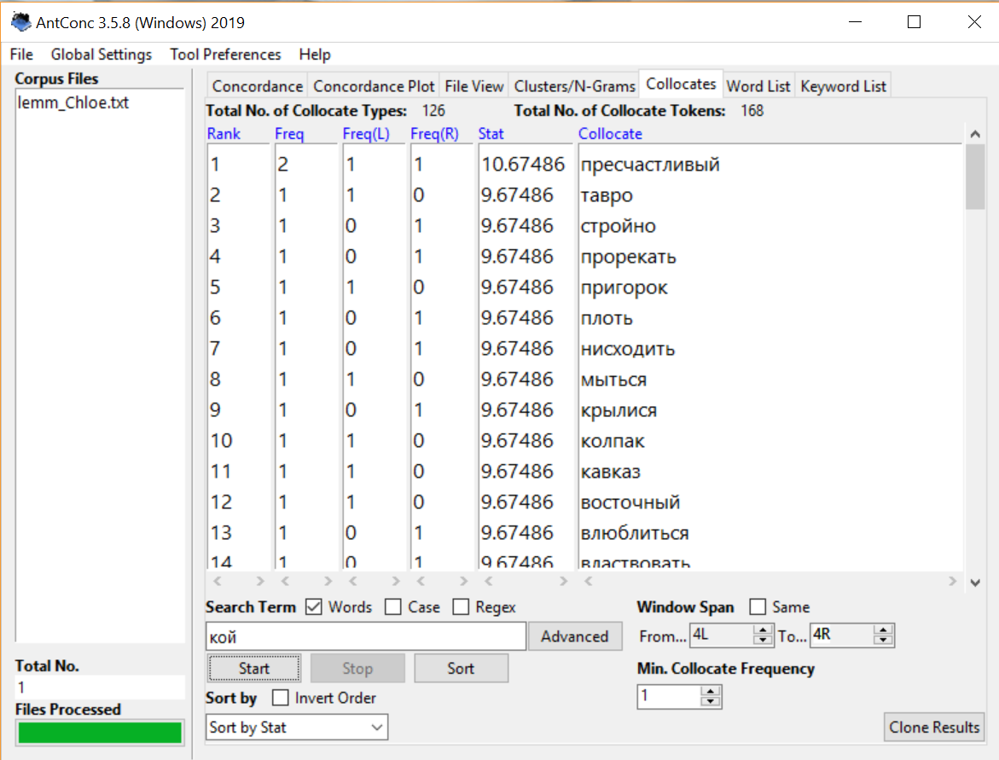

# HW3
1)

2)

3)

4)

5)

6)

График частотности слова "орда"

Домашняя работа:
1. AntConc
№4

№5

№6

2. Google Ngrams и НКРЯ 
1) Устаревшие слова:
Досель, хула, труждаться, поднесь, зывать, кой, простереть, сей, чело, втуне, посмех, возопиять

2) Сравнение употребления слов (3) с современными аналогами в Google Ngrams и НКРЯ:

Хула и осуждение:

Хула 
Осуждение 
Таким образом, мы видим, что в период с 1800 по 1816 оба слова были популярны, однако впоследствии "хула" стало устаревшим, а "осуждение" продолжает использоваться. Кроме того, во многих текстах слово "хула" чаще всего употребляется с прилагательным "злобная", чего мы не можем сказать про "осуждение".

Поднесь и до сих пор:

Поднесь 
До сих пор 
Таким образом, можно заметить, что употребляемость слова "поднесь" всегда была крайне мала. "До сих пор" приобрело популярность в период с 1920 по 1940 и продолжило часто употребляться. Стоит также отметить, что "поднесь" употреблялось исключительно с наречиями, за редким исключением с глаголами; "до сих пор" может употребляться как с наречиями и глаголами, так и с существительными.

Простереть и протянуть:

Простереть 
Протянуть 
Таким образом, мы видим, что слово "простереть" не так часто встречается в текстах, чем "протянуть". Однако в период с 1860 по 1880 примечательно, что слово "протянуть" чаще употребляется в составе фразеологизма "протянуть ноги", в то время как "простереть" употребляется почти со всеми частями речи.

3) ipm для каждого слова (приблизительные значения):
Досель - 0.26
Хула - 2.25
Труждаться - 0.48
Поднесь - 0.25
Зывать - 0.04
Кой - 110.5
Простереть - 5.57
Сей - 578.1
Чело - 9.46
Втуне - 1
Посмех - 0.1
Возопиять - 0.25

3. Использование инструментов корпусного анализа в профессиональной деятельности.
Исследование корпуса помогло мне понять, что найти любое слово в текстах разных времён не так сложно, как это кажется на первый взгляд. Я узнала, как работать с различными корпусами (до этого мне не приходилось с ними взаимодействовать), выяснила, что есть не только НКРЯ, но и другие интересные вещи. Правда, я пока не знаю, помогут ли мне данные знания в дальнейшем, поскольку ранее мне не приходилось использовать подобные ресурсы при работе с текстами. Возможно, это будет полезно, если я решу найти закономерность употребления определённых слов в ту или иную эпоху.
