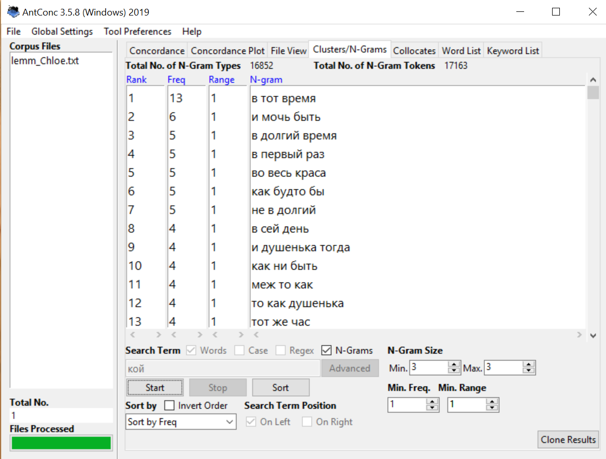

# HW3
1)

2)

3)

4)

5)

6)

График частотности слова "орда"

Домашняя работа:
1. AntConc
№4

№5

№6

2. Google Ngrams и НКРЯ 
1) Устаревшие слова:
Досель, хула, труждаться, поднесь, зывать, кой, простереть, сей, чело, втуне, посмех, возопиять
2) Сравнение употребления слов (3) с современными аналогами в Google Ngrams и НКРЯ:
Хула и осуждение:

Хула 
Осуждение 

